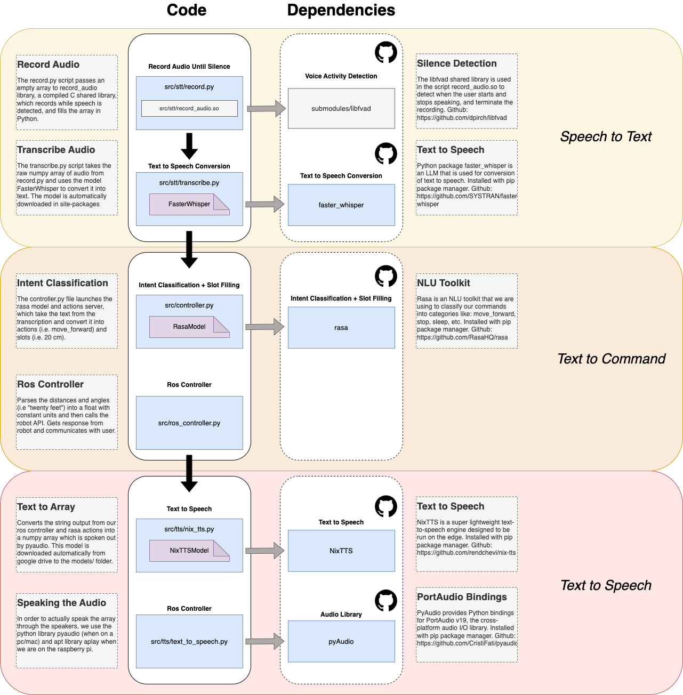

# Language Model

## Running 

To run the model, first ensure you have an environment with python 3.10 (you can do this most easily using [miniconda](https://docs.anaconda.com/miniconda/)), install the requirements using: `pip install -r requirements.txt` and then run the server/language model with: `bash ./start.sh`. If you have also already compiled the vision model, you may run that as well using `bash ./start.sh --vision`.

## Introduction 

The language model is composed of three parts: speech-to-text, text-to-command and text-to-speech. See below the entire workflow for the language model, and the associated dependencies and scripts. For more information about the text-to-command section, see `data/rasa`.



## Language - setup

Note that the language model has only been developed to work on unix-like systems: macOS and linux. If on mac, you will need to ensure you have [homebrew](https://brew.sh/) installed. You may install as follows:

```bash
/bin/bash -c "$(curl -fsSL https://raw.githubusercontent.com/Homebrew/install/HEAD/install.sh)"
(echo; echo 'eval "$(/home/linuxbrew/.linuxbrew/bin/brew shellenv)"') >> /home/arch/.bashrc
sudo pacman -S base-devel
eval "$(/home/linuxbrew/.linuxbrew/bin/brew shellenv)"
```

Once brew is installed, ensure that gcc and all other dependencies are installed:

```bash
brew install gcc
brew install --cask miniconda
brew install portaudio
brew install espeak
brew install automake
brew install libtool
```

Now, you must create a development environment with python3.10 using [miniconda](https://docs.anaconda.com/miniconda/), which is an enviornment manager for python:

```bash
eval "$(/Users/"${USER}"/opt/anaconda3/condabin/conda shell.bash hook)"
conda create -n python310 python=3.10
conda activate python310
```

Now we can proceed to installing all the dependencies for the controller.py:

```bash
pip install -r requirements.txt
```

NOTE: It is probable that you will have problems installing pyaudio while installing the entire requirements file. The most common problem will be that portaudio didn't link properly, so you need to extract the path to the library and link it manually when installing pyaudio:

```bash
output=$(brew link portaudio 2>&1)
path=$(echo "$output" | grep -oE '/[^ ]+/portaudio/[0-9]+\.[0-9]+\.[0-9]+')
echo "Extracted path: $path"
export CFLAGS="-I${path}/include"
export LDFLAGS="-L${path}/lib"
pip install pyaudio
```

Now that pyaudio is installed, you must re-try the installation of the complete `requirements.txt` file:


```bash 
pip install -r requirements.txt
```

Once that is finished, you must install the requirements for compilation of record_audio.so

```bash
git submodule update --init submodules/libfvad/
cd submodules/libfvad/
autoreconf -i
./configure
make
sudo make install
cd ../../
```

Now you may compile the file:

Note that you will need to run this again if you're in a new shell 
```bash
output=$(brew link portaudio 2>&1)
path=$(echo "$output" | grep -oE '/[^ ]+/portaudio/[0-9]+\.[0-9]+\.[0-9]+')
echo "Extracted path: $path"
```

```bash
cd src/stt
gcc -shared -o record_audio.so -fPIC record_audio.c  -lportaudio -lfvad -I${path}/include  -L${path}/lib
```

## Language - running

There are two principal modes of running the language model. The first is through the controller directly, which 

```bash python3 controller.py```

This should start an interactive session for working with the chat bot. It is likely that there are some errors, as we are using lots of different libraries for this chat bot. Here are some of the errors I encountered, and how i solved them:

### Cannot link libespeak.dylib

```bash 
Exception: Ensure espeak is installed and add path to `libespeak.dylib` here
```

In order to fix this problem, ensure that espeak is installed:

```bash 
brew install espeak 
which espeak
```

And get the path to espeak and export it as follows

```bash 
espeaklib="$(dirname $(which espeak))/../lib"

# this is for linux
export LD_LIBRARY_PATH=${espeaklib}:$LD_LIBRARY_PATH
export DYLD_LIBRARY_PATH=${espeaklib}:$DYLD_LIBRARY_PATH
```

Now try launching again

### espeak not installed on your system!

This should be automatically fixed in the config.py file.

### Segmentation fault, FasterWhisper

One problem that appeared multiple times during development is a Segmentation fault caused by having multiple copies of the shared library `libiomp5.dylib`, one in ctranslate2 and the other in torch:

```
Segmentation fault: 11
/Users/RileyBallachay/opt/anaconda3/envs/python3.10/lib/python3.10/multiprocessing/resource_tracker.py:224: UserWarning: resource_tracker: There appear to be 1 leaked semaphore objects to clean up at shutdown
```

To fix this problem, find the copies of the shared library inside of your enviornment and delete those associated with torch, then symlink those to the ctranslate2 version:

```
find /Users/RileyBallachay/opt/anaconda3/envs/python3.10 -name "libiomp5.dylib"

rm /Users/RileyBallachay/opt/anaconda3/envs/python3.10/lib/python3.10/site-packages/torch/lib/libiomp5.dylib
rm /Users/RileyBallachay/opt/anaconda3/envs/python3.10/lib/python3.10/site-packages/functorch/.dylibs/libiomp5.dylib

ln -s /Users/RileyBallachay/opt/anaconda3/envs/python3.10/lib/python3.10/site-packages/ctranslate2/.dylibs/libiomp5.dylib /Users/RileyBallachay/opt/anaconda3/envs/python3.10/lib/python3.10/site-packages/functorch/.dylibs/libiomp5.dylib

ln -s /Users/RileyBallachay/opt/anaconda3/envs/python3.10/lib/python3.10/site-packages/ctranslate2/.dylibs/libiomp5.dylib /Users/RileyBallachay/opt/anaconda3/envs/python3.10/lib/python3.10/site-packages/torch/lib/libiomp5.dylib
```

## Profiling 

Using activity monitor and intruments in mac, I was able to determine the CPU and memory usage of each of the components of both the vision and language models. Here is a summary:

__Language__

| Component         | CPU Usage (max, %) | CPU Usage (threads) | Memory Usage (max, MB)    |
|--------------|-----|-----|---------------|
| controller.py        | 105  | 32  | 500      |
| rasa-model          | 25  |  22 | 900      |
| rasa-actions      | 1  | 2 | 80      |

Note that for the controller.py, we are loading nix-tts, which is likely consuming the majority of the memory used in the controller.py, as the model itself is 5.5M decoder, 15M encoder. I have separated the model and actions, as these are launched as subprocesses, so they have a different PID. 