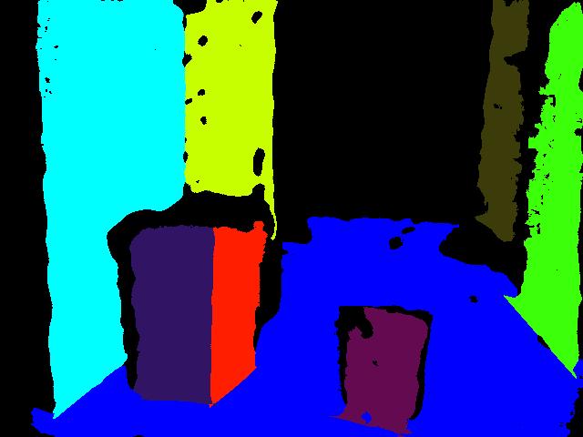

# Plane Segmentation using RGB-D Cameras

A few different approaches were investigated for surface segmentation (and drivable surface segmentation in particular). An example of a very similar application of an autonomous mobile robot with an RGB-D camera is [An Open-Source Low-Cost Mobile Robot System With an RGB-D Camera and Efficient Real-Time Navigation Algorithm](https://ieeexplore.ieee.org/abstract/document/9970319). The authors implement their own algorithm for drivable surface segmentation, but they reference another paper [Real-Time Plane Segmentation using RGB-D Cameras](https://link.springer.com/chapter/10.1007/978-3-642-32060-6_26). First, surfaces are segmented, and with the computed normals, we find the most probable ground surface based on the normal angle. We will subsequently need to compute the distance to obstacles in the point cloud and determine if the robot may proceed in a certain direction before striking an object.

## [RGBDPlaneDetection](https://github.com/chaowang15/RGBDPlaneDetection)

The best repository for RGBD plane detection I could find is [RGBDPlaneDetection](https://github.com/chaowang15/RGBDPlaneDetection). This provides the point cloud plane fitting and plane refinement. In order to adapt this code, I copied over the `plane_detection.cpp` and `include/` made the necessary adjustments to accept the realsense images and then built the project. The results are much better than any CNN I could find. See the results below:

    
    

### Finding the ground plane

Finding the ground plane in the list of planes is relatively simple. Assuming that the robots camera is correctly positioned on top of the robot (i.e. it is parallel to the ground), we know that the y-component of the normal vector for the ground surface should be approximately zero. 

### Improving the depth map

The depth map by default is not very good/stable. Each time it is captured, there are large holes and other artifacts that mess with the accuracy of downstream applications. A description of the full range of post-processing that may be performed [can be found here](https://dev.intelrealsense.com/docs/depth-post-processing). According to the docs, no post-processing is performed on the on-board processor, meaning that all of this is handed over to the host processer + realsense2 SDK. The filters recommended by Intel were used, which inludes the following 

### Angle of incidence + reflection

The angle at which a surface is viewed using a "structured light for depth sensing" - style camera is very important. This appears to be a result of a combination of specular/diffuse highlights that occur at different viewing angles. One paper that discusses this subject at length is [Diffuse Structured Light](https://ieeexplore.ieee.org/document/6215216), in which the authors propose a diffuse light filter to avoid artifacts that will disrupt sensor accuracy. Compare the quality of the depth images below taken when the camera is perpendicular vs incident/parallel to a certain surface. It is thus harder to extract depth from surfaces that are at smaller angles relative to the point of view of the camera.

|  |  |
|:--:|:--:|
| Perpendicular raw image | Perpendicular depth image |

|  |  |
|:--:|:--:|
| Parallel raw image | Parallel depth image |

## Building the project

In order to build the project, you need to ensure you have librealsense2 installed. You can then navigate to this folder and run: `bash ./build.sh`

