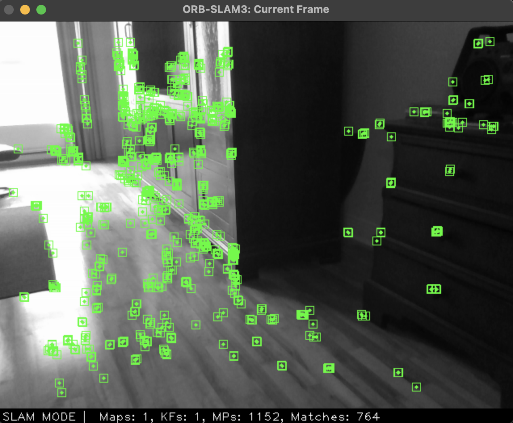
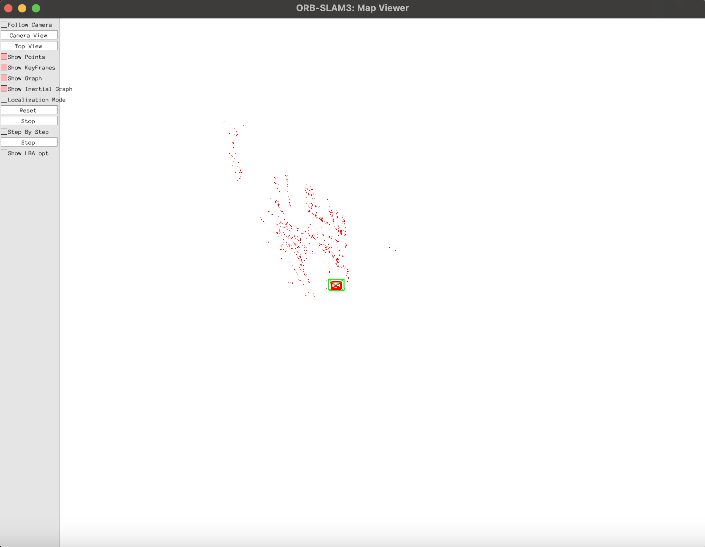
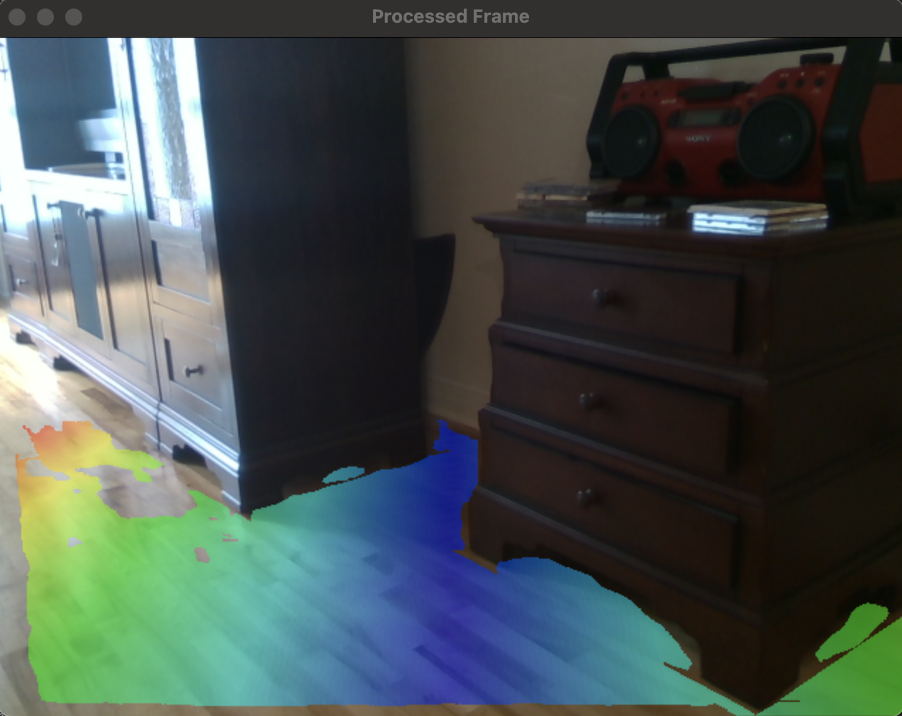

# Vision Model

## vision.cpp

This script is the main vision model. It can run in two different modes, mapping and localization. In mapping mode, we run ORB_SLAM3 and create a map file which is written permanently to disk. In localization mode, we load a map (must already have saved a map to disk) and then localize the camera in that space. We then use a destination point in the original map, and use our planeSegment algorithm to help and navigate to our destination. Here are the sample frames from running localize:


<div style="display: flex; justify-content: space-between;">
    
    
</div>


## src/rgbdSeg/planeSegment.cpp

This script is used to test out the quality of the plane segmentation algorithm. For a full description of how this algorithm works, see [the artifical potential fields documentation](https://github.com/rballachay/morbius/tree/main/vision/src/rgbdSeg#artificial-potential-fields). Building this script will build the intel realsense handler and artificial potential fields header, which are both used by planeSegment.cpp. See what the output looks like below. The darkest blue line is the path of least resistance, and the color gradient from blue to red indicates the distance to that path. 




## Vision - setup

There are two principal ways of running the vision model. The first is to run just the local ground plane segmentation, and the second is to run the complete model. In order to build each of these, you must run the following commands:

### Building vision.cpp

From the current directory (`vision`), you can run the following. This will build ORB_SLAM, then use the following command to run

```bash
bash build.sh
sudo ./vision  submodules/ORB_SLAM3/Vocabulary/ORBvoc.txt ./data/ORB_SLAM3/RealSense_D415.yaml
```


## Profiling 

Using activity monitor and intruments in mac, I was able to determine the CPU and memory usage of each of the components of both the vision and language models. Here is a summary:

__vision__

| Component         | CPU Usage (max, %) | CPU Usage (threads) | Memory Usage (max, MB)    |
|--------------|-----|-----|---------------|
| vision        | 85  | 40  | 680      |

The planeSegment algorithm is relatively low-impact relative to ORBSLAM.

__planeSegment__

| Component         | CPU Usage (max, %) | CPU Usage (threads) | Memory Usage (max, MB)    |
|--------------|-----|-----|---------------|
| planeSegment        | 94  | 29  | 99      |

The planeSegment algorithm is relatively low-impact relative to ORBSLAM.


