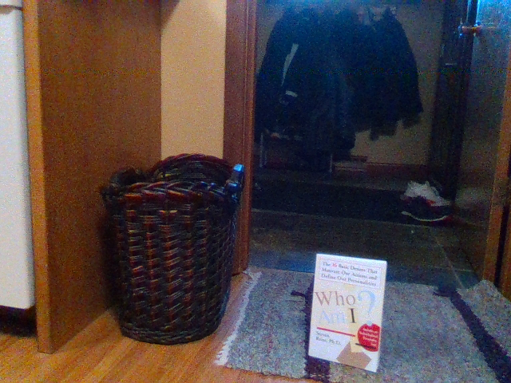
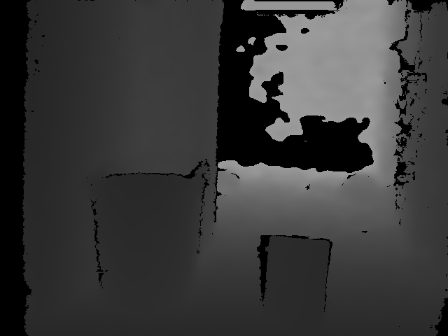
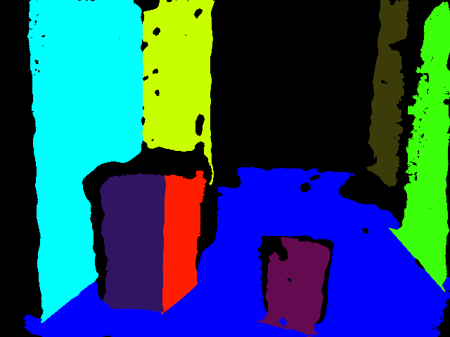
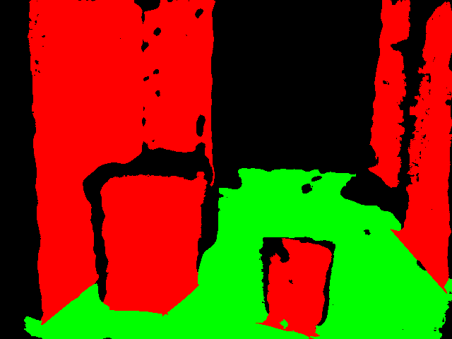
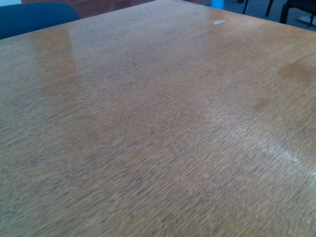
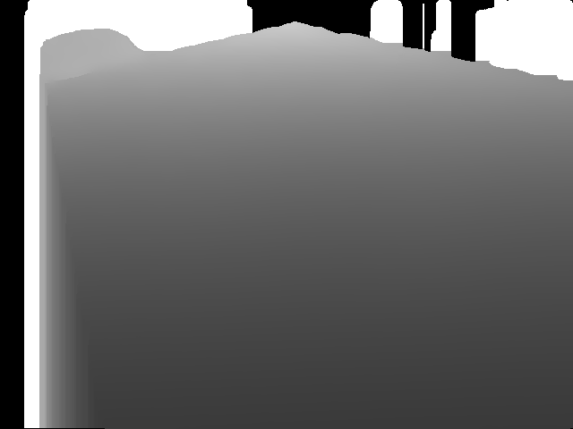
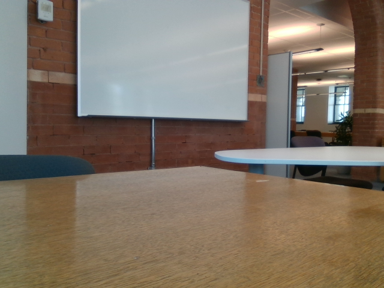
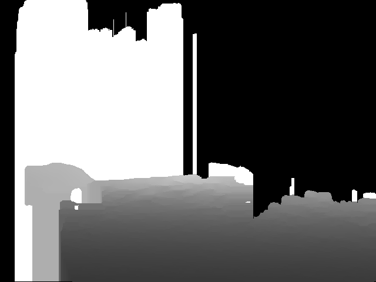
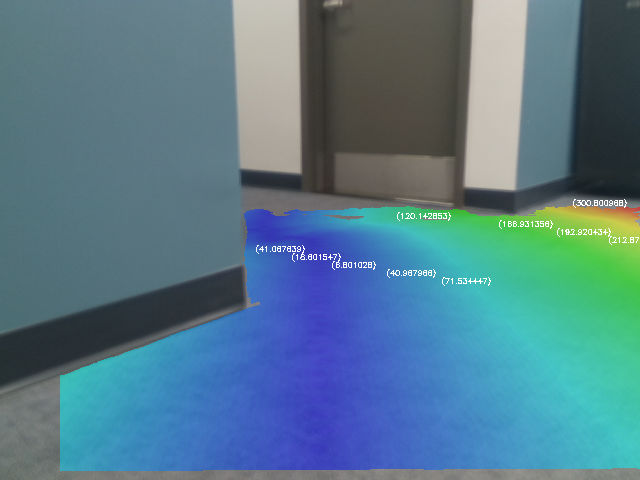

# Plane Segmentation using RGB-D Cameras

A few different approaches were investigated for surface segmentation (and drivable surface segmentation in particular). An example of a very similar application of an autonomous mobile robot with an RGB-D camera is [An Open-Source Low-Cost Mobile Robot System With an RGB-D Camera and Efficient Real-Time Navigation Algorithm](https://ieeexplore.ieee.org/abstract/document/9970319). The authors implement their own algorithm for drivable surface segmentation, but they reference another paper [Real-Time Plane Segmentation using RGB-D Cameras](https://link.springer.com/chapter/10.1007/978-3-642-32060-6_26). First, surfaces are segmented, and with the computed normals, we find the most probable ground surface based on the normal angle. We will subsequently need to compute the distance to obstacles in the point cloud and determine if the robot may proceed in a certain direction before striking an object.

## [RGBDPlaneDetection](https://github.com/chaowang15/RGBDPlaneDetection)

The best repository for RGBD plane detection I could find is [RGBDPlaneDetection](https://github.com/chaowang15/RGBDPlaneDetection). This provides the point cloud plane fitting and plane refinement. In order to adapt this code, I copied over the `plane_detection.cpp` and `include/` made the necessary adjustments to accept the realsense images and then built the project. The results are much better than any CNN I could find. See the results below:

    
    

### Finding the ground plane

Finding the ground plane in the list of planes is relatively simple. Assuming that the robots camera is correctly positioned on top of the robot (i.e. it is parallel to the ground), we know that the y-component of the normal vector for the ground surface should be approximately -1, meaning it will be pointing directly upwards.

### Improving the depth map

The depth map by default is not very good/stable. Each time it is captured, there are large holes and other artifacts that mess with the accuracy of downstream applications. A description of the full range of post-processing that may be performed [can be found here](https://dev.intelrealsense.com/docs/depth-post-processing). According to the docs, no post-processing is performed on the on-board processor, meaning that all of this is handed over to the host processer + realsense2 SDK. In addition, we have determined that we can greatly improve accuracy by taking the average of the color and depth map over 10 frames and performing plane Segmentation on this combined data. 

### Angle of incidence + reflection

The angle at which a surface is viewed using a "structured light for depth sensing" - style camera is very important. This appears to be a result of a combination of specular/diffuse highlights that occur at different viewing angles. One paper that discusses this subject at length is [Diffuse Structured Light](https://ieeexplore.ieee.org/document/6215216), in which the authors propose a diffuse light filter to avoid artifacts that will disrupt sensor accuracy. Compare the quality of the depth images below taken when the camera is perpendicular vs incident/parallel to a certain surface. It is thus harder to extract depth from surfaces that are at smaller angles relative to the point of view of the camera.

|  |  |
|:--:|:--:|
| Perpendicular raw image | Perpendicular depth image |

|  |  |
|:--:|:--:|
| Parallel raw image | Parallel depth image |

## Building and running the project

In order to build the project, you need to ensure you have librealsense2 installed. You can then navigate to this folder and run: `bash ./build.sh`

You may then run the project as follows (assuming you have the camera attached to your computer): `sudo ./planeSegment`.

## [Artificial Potential Fields](https://www.mdpi.com/2076-3417/10/24/8987)

Artificial potential fields are a local path planning algorithm for robotic motion. We use a combination of a destination point in (X,Y,Z) which has a certain attractive force and a collection of points/objects in (X,Y,Z) which have repulsive force in the direction of their normal. We summarize the attractive force of the destination and repulsive force of the obstacles, resulting in a vector which indicates the optimal direction. We can iteratively take a step in this direction (without moving) and re-calculate the direction and compute an optimal path. We can then calculate the distance of all points on our surface from this optimal path to create a heatmap. See an example of this heatmap below.

The steps in this algorithm are as follows:

1. Capture depth frame and RGB image from realsense camera
2. Accumulate 10 different frames and take average
3. Run plane detection on averaged depth/color image
4. Assign ground plane based on normal 
5. Calculate equation of ground plane using normal/center
6. Take points from plane detection cloud and project onto ground plane
7. Refine points on ground to ensure spacing and max/min values
8. Calculate sum of forces from heading vector + objects
9. Move one step in direction of sum of forces
10. Repeat steps 8 and 9 until destination is reached 
11. Calculate distance of all points from 'optimal path'
12. Draw floor based on distance from optimal path